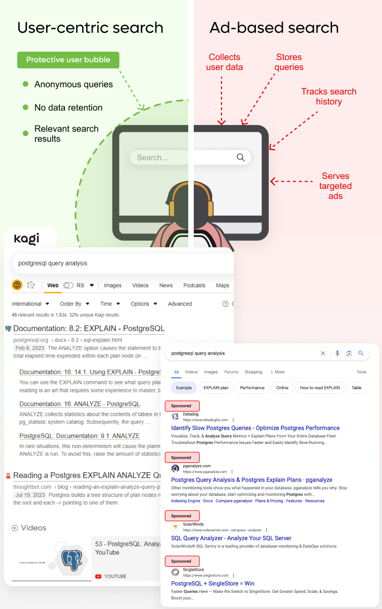

# The real cost of "free" search

Everyone pays for search. The difference is whether you're paying with your attention, time, and private data - or with your wallet.

## The hidden price tag

In 2022, advertisers spent **$185.35 billion** to influence your search results. By 2028, they'll spend **$261 billion**. This isn't just numbers - it's an arms race for your attention.

Every dollar spent makes your search results:
- More cluttered with ads
- Harder to navigate
- Slower to deliver answers
- More privacy-invasive

## The warning we ignored

> "**The goals of the advertising business model do not always correspond to providing quality search to users... advertising funded search engines will be inherently biased towards the advertisers and away from the needs of the consumers.**"
>
> 
> — [The Anatomy of a Large-Scale Hypertextual Web Search Engine](http://infolab.stanford.edu/pub/papers/google.pdf), Sergey Brin and Lawrence Page, 1998

They predicted this crisis. Then Google transformed from organizing the world's information to organizing the world's ads. The result? A [great deterioration of web and search](https://dkb.io/post/DEPR_google-search-is-dying) that affects us all.

## The true cost in numbers

Let's be crystal clear about what "free" really costs:
- Google generated **$76 billion** in US ad revenue (2023)
- They make **$277 per user** annually in the US
- That's **$23 per month** someone pays to influence your results
- Your attention is literally being auctioned to the highest bidder

**Google is only "free" if your time has no value.** Every ad, every clickbait result, every distraction steals minutes of your life you'll never get back.

Moreoever, "free" search engines come at a real cost, not just inconvenience, but financial harm and vulnerability to scams. The business model muddle is real. Illusion of "free" is real. Boston Globe's Aaron Pressman describes the journey that ultimately [led him to Kagi](https://www.bostonglobe.com/2025/04/01/business/google-search-problems-alternatives-kagi/):

## The Kagi difference

We built a better way:
- Direct alignment: You pay us, we work for YOU
- No conflicting interests
- No compromise on quality
- Complete privacy protection
- Tools and features built for users, not advertisers

## Choose your future

Kagi brings a new model to the market - pay for your search with your wallet instead. For only $5/mo (Starter plan) or $10/mo (unlimited search plan) you can now search with a peace of mind, knowing the results are always shown with your best interest in mind.

[View detailed plan comparison →](../plans/plan-types.md)

## Beyond the price tag

The web we want isn't free, but it's worth paying for. Read [The Age of PageRank is Over](https://blog.kagi.com/age-pagerank-over) to understand why we're building a better future for search.

When you choose Kagi, you're not just buying a service. You're investing in a better, more ethical web. One where your privacy matters, your time is valued, and your search results serve you - not advertisers.

The question isn't "Why pay for search?"
It's "Why settle for less?"

##  Why quality software isn't free
> We have become numb to the taste of good software and hypnotized by the idea of "free".

We recommend reading [this article](https://stephango.com/quality-software) about why quality software deserves your hard‑earned cash. Industrial software from big tech companies are subsidized by advertising, proprietary ecosystems, or enterprise contracts, creating the illusion that software should be cheap or "free". This often comes at the cost of your privacy and quality of the product. In contrast, independent makers like Kagi not only prioritize privacy but also the craftsmanship of our products. We listen and act upon your [feedback](https://kagifeedback.org/) and suggestions, as we're building tools that truly serve you. 

[Start your journey →](https://kagi.com/signup?plan_id=trial)

