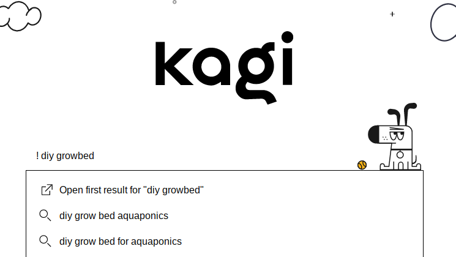

# Bangs

Bangs are shortcuts starting with exclamation points (!) that quickly take you to search results on other sites. For example, searching Kagi for **!w Monty Python** will search Wikipedia directly for "Monty Python" and take you to that Wikipedia search result.

To take advantage of Bangs make sure you have enabled Bangs in your [Search](https://kagi.com/settings?p=search) settings. You can also set up Quick Bangs and Custom Bangs, continue reading to learn more.

Note that Kagi supports all [DuckDuckGo-style bangs](https://duckduckgo.com/bang).

## Bang Examples

Bangs can also be used regionally. For example, you can search with  **!de [query]** or **!nl [query]** to switch your region to Germany or Netherlands on the fly.

Some of the more popular search bangs include:

- **!r** for [Reddit](https://www.reddit.com)
- **!u** for [Urban Dictionary](https://www.urbandictionary.com)
- **!imd** for the [Internet Movie Database](https://www.imdb.com/)
- **!i** for Kagi Images
- **!m** for Kagi Maps
- **!n** for Kagi News
- **!v** for Kagi Videos
- **!help** to search this knowledge base for information about Kagi Search

## Supported Bang Syntaxes

For convenience, Kagi supports placing the bang trigger elsewhere in your query.

Here is the full list of patterns that we support:

- `!g query`
- `g! query`
- `query !g`
- `query g!`

## Quick Bangs

For convenience, Kagi allows you to customize Quick Bangs which do not require an exclamation (!).

Configure Quick Bangs under [Search](https://kagi.com/settings?p=search) in the Kagi Settings.

## Custom Bangs

You can create your own Custom Bangs in [Advanced Settings](https://kagi.com/settings?p=advanced).

Once you "Open Bangs" you will see any existing custom bangs.

From here you can "Add Bang" to define new custom bangs.

You can create your own Custom Bangs in Kagi using the [Search Shortcuts menu](search-shortcuts.md).

## Watch a Demo

You can see a full demo of using bangs - default, new and custom - by watching the video below.

<iframe width="560" height="315" src="https://www.youtube.com/embed/4Cy8PHrVs5Y" title="YouTube video player" frameborder="0" allow="accelerometer; autoplay; clipboard-write; encrypted-media; gyroscope; picture-in-picture" allowfullscreen></iframe>

## Feeling Lucky

Sometimes, you just know the first result will be what you want.
Or, you could be "feeling lucky" enough to take the chance!

When you start your query with `!(space)query`, Kagi will redirect you to the first search result.

Here is the full list of "feeling lucky" patterns that we support:

- `! query`
- `query !`
- `\query`

## Universal Summarizer

Use the [universal summarizer](../ai/summarize-page.md) with `!sum <url>` or `!summarize <url>`. Summarize key moments with `!sumk <url>` or `!summarizekey <url>`.
